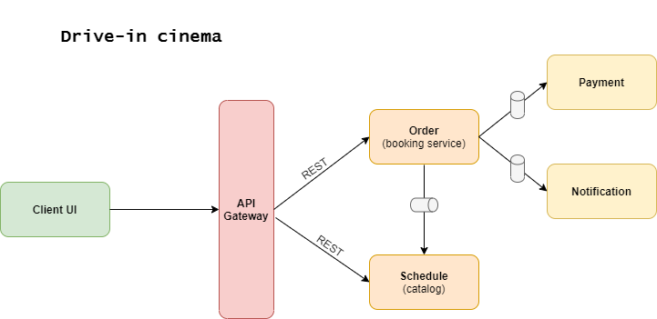

schedule: https://github.com/aliya2409/cinema-schedule
order: https://github.com/aliya2409/cinema-order
payment: https://github.com/aliya2409/cinema-payment
notification: https://github.com/aliya2409/cinema-notification

User stories:
1. As a customer, I want to buy tickets and get them from my email;
2. As a customer, I want to get a cinema schedule for a specific date with number of tickets left;
3. As a cinema employee, I want to register tickets purchases in a cashbox;
4. As a cinema employee, I want to update cinema schedule;

SOA version:

